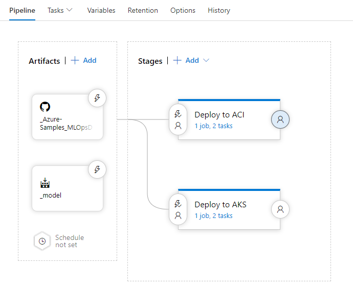
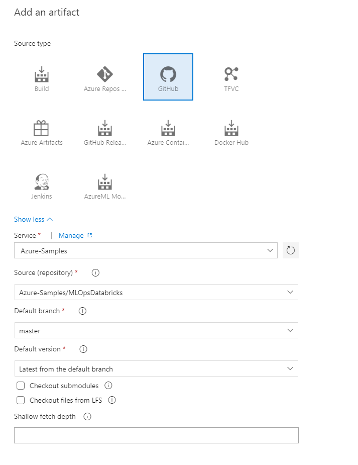
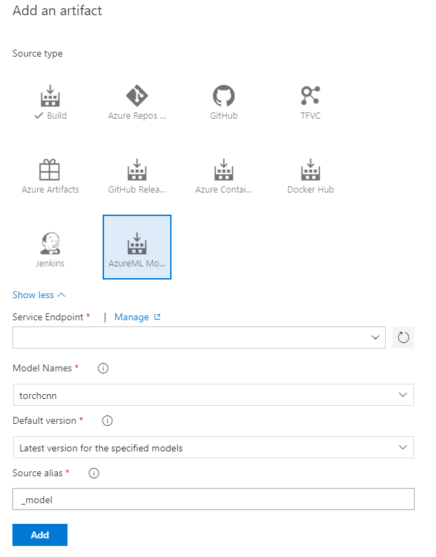
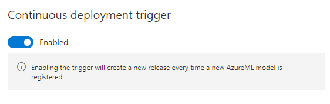

# Setting Release Pipeline for Model Deployment 

This Azure DevOps release pipeline will deploy trained model to Azure Container Instance or Azure Kubernetes Services  every time a new model is registered in the Azure Machine Learning Service workspace. 



## Pre-requisite Steps

Install the Azure Machine Learning extension from the [marketplace]( https://marketplace.visualstudio.com/items?itemName=ms-air-aiagility.vss-services-azureml) to the desired Azure DevOps account.

## Tasks

1. Add Release Artifacts (GitHub and AzureML Model)
1. Add Deployment Stage (ACI or AKS)
1. Trigger Pipeline and view API being served

## 01 - Add Release Artifacts

  ### Source Code artifact

  Fork this GitHub repository if it hasn't been done already and then add the associated GitHub artifact to a new release pipeline.

  

  ### AzureML Model Artifact 

  

  [Enabling the continuous deployment trigger](https://docs.microsoft.com/azure/devops/pipelines/release/triggers?view=azure-devops) on this Azure ML artifact will trigger the release pipeline every time a new version of the model is registered in the Azure Machine Learning workspace
  

## 02 – Add Deployment Stage

There are two deployment options for the model using the AzureML service to make it easy to package up the model file into a container and serve it via an API. After the common steps, choose either 2a to deploy to Azure Container Instances (ACI) or 2b to deploy to Azure Kubernetes Services (AKS).

### Common steps in both the stages

  Add the Azure CLI task and then add the following code to the inline script: 

- [Installs AzureML CLI](https://docs.microsoft.com/en-us/azure/machine-learning/service/reference-azure-machine-learning-cli)

  `az extension add -n azure-cli-ml`

- [Deploys model with CLI command](https://docs.microsoft.com/en-us/cli/azure/ext/azure-cli-ml/ml/model?view=azure-cli-latest#ext-azure-cli-ml-az-ml-model-deploy)

  `az ml model deploy`

- [Inference Config from source](../src/score/inference_config.yml)

  ```yaml
  entryScript: score.py
  runtime: python
  condaFile: conda_dependencies.yml
  extraDockerfileSteps:
  schemaFile:
  dependencies:
  enableGpu: False
  baseImage:
  baseImageRegistry:
  ```

### 02.a – Deploy to ACI

  [ACI Deployment Config](../src/score/deployment_config_aci.yml)

  ```yaml
  containerResourceRequirements:
    cpu: 1
    memoryInGB: 1
  computeType: ACI
  ```

### 02.b – Deploy to AKS

[AKS Deployment Config](../src/score/deployment_config_aks.yml)


```yaml
computeType: AKS
autoScaler:
    autoscaleEnabled: True
    minReplicas: 1
    maxReplicas: 3
    refreshPeriodInSeconds: 10
    targetUtilization: 70
authEnabled: True
containerResourceRequirements:
    cpu: 1
    memoryInGB: 2
appInsightsEnabled: False
scoringTimeoutMs: 5000
maxConcurrentRequestsPerContainer: 2
maxQueueWaitMs: 5000
sslEnabled: True
```

## 03 - Trigger Pipeline and view API

After the Azure CLI task has been configured either deploy a new model to the attached artifact or manually trigger a release with the latest model artifact.

Once it is complete, view the log files from the executed Azure CLI task to determine the API's URL.  

With ACI it should look something like this where the `scoringUri` is where the API is served.

```shell
2019-07-06T00:59:41.7979279Z ACI service creation operation finished, operation "Succeeded"
2019-07-06T00:59:41.7979391Z {
2019-07-06T00:59:41.7979526Z   "computeType": "ACI",
2019-07-06T00:59:41.7979670Z   "imageId": "torchcnnnaci:3",
2019-07-06T00:59:41.7979772Z   "modelDetails": "torchcnn [Ver. 6]",
2019-07-06T00:59:41.7979920Z   "name": "torchcnnnaci",
2019-07-06T00:59:41.7980058Z   "properties": {
2019-07-06T00:59:41.7980168Z     "azureml.git.commit": "971e9eb8326afed5994e781a1c03a33221ce2092",
2019-07-06T00:59:41.7980326Z     "azureml.git.dirty": "False",
2019-07-06T00:59:41.7981217Z     "azureml.git.repository_uri": "https://github.com/Azure-Samples/MLOpsDatabricks.git",
2019-07-06T00:59:41.7981377Z     "mlflow.source.git.commit": "971e9eb8326afed5994e781a1c03a33221ce2092",
2019-07-06T00:59:41.7981836Z     "mlflow.source.git.repoURL": "https://github.com/Azure-Samples/MLOpsDatabricks.git"
2019-07-06T00:59:41.7982010Z   },
2019-07-06T00:59:41.7982142Z   "runtimeType": "Python",
2019-07-06T00:59:41.7982917Z   "scoringUri": "http://ed1a4489-1219-4196-9638-32bf81750c15.eastus.azurecontainer.io/score",
2019-07-06T00:59:41.7983100Z   "state": "Healthy",
2019-07-06T00:59:41.7983231Z   "tags": "",
2019-07-06T00:59:41.7983707Z   "updatedAt": "2019-07-06T00:58:09.752479+00:00"
2019-07-06T00:59:41.7983853Z }
```

With AKS it should look something like this where the `scoringUri` is where the API is served.

```shell
2019-07-06T00:59:41.9345485Z Creating service
2019-07-06T00:59:41.9346166Z AKS service creation operation finished, operation "Succeeded"
2019-07-06T00:59:41.9346370Z {
2019-07-06T00:59:41.9346450Z   "computeType": "AKS",
2019-07-06T00:59:41.9346612Z   "imageId": "torchcnnaks:2",
2019-07-06T00:59:41.9346709Z   "modelDetails": "torchcnn [Ver. 6]",
2019-07-06T00:59:41.9346983Z   "name": "torchcnnaks",
2019-07-06T00:59:41.9347106Z   "properties": {
2019-07-06T00:59:41.9347227Z     "azureml.git.commit": "971e9eb8326afed5994e781a1c03a33221ce2092",
2019-07-06T00:59:41.9347335Z     "azureml.git.dirty": "False",
2019-07-06T00:59:41.9348191Z     "azureml.git.repository_uri": "https://github.com/Azure-Samples/MLOpsDatabricks.git",
2019-07-06T00:59:41.9348372Z     "mlflow.source.git.commit": "971e9eb8326afed5994e781a1c03a33221ce2092",
2019-07-06T00:59:41.9348712Z     "mlflow.source.git.repoURL": "https://github.com/Azure-Samples/MLOpsDatabricks.git"
2019-07-06T00:59:41.9348824Z   },
2019-07-06T00:59:41.9348891Z   "runtimeType": "Python",
2019-07-06T00:59:41.9349198Z   "scoringUri": "http://52.165.220.48:80/api/v1/service/torchcnnaks/score",
2019-07-06T00:59:41.9349305Z   "state": "Healthy",
2019-07-06T00:59:41.9349378Z   "tags": "",
2019-07-06T00:59:41.9349716Z   "updatedAt": "2019-07-06T00:58:34.413656+00:00"
2019-07-06T00:59:41.9349822Z }
```

See a sample implementation for release pipeline [here](https://aidemos.visualstudio.com/MLOps/_releaseProgress?_a=release-pipeline-progress&releaseId=11)