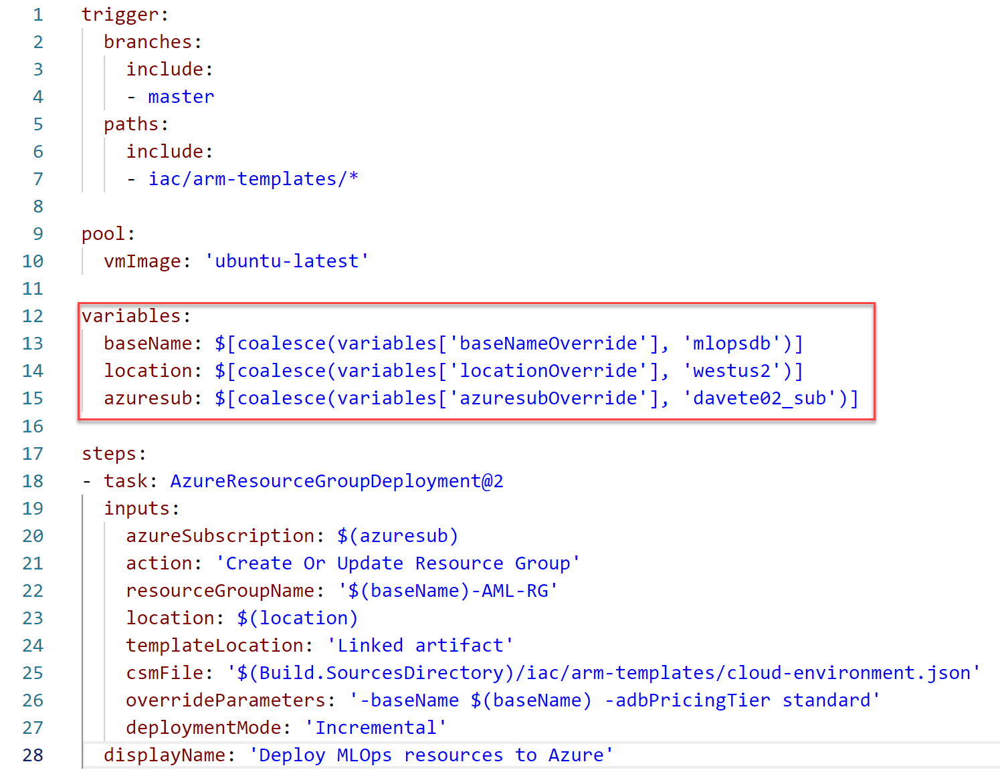

# Setting up the Cloud Infrastructure

To run this project, you must have the following resources set up
in your Azure Subscription:

- Machine Learning Service
- Key Vault
- Databricks Workspace

To do so, you can take advantage of the *Infrastructure as Code (IaC)* also available
with this code structure. With the steps below, you will set up a pipeline that
will create and maintain the minimum required infrastructure to run this code.

> This pipeline is idempotent. So, whenever you make any change to the
> infrastructure manifest (IaC) and run this pipeline again, the resources will
> be updated to match the code.

To create and run the IaC Pipeline, you will need:

- administrative privileges to an Azure Subscription
- administrative privileges on an Azure DevOps Team Project

## Walkthrough

### 01 - Import this repository

The first step is to import this repository to either your
[GitHub](https://help.github.com/en/articles/importing-a-repository-with-github-importer)
account or a repository on your
[Azure DevOps](https://docs.microsoft.com/en-us/azure/devops/repos/git/import-git-repository?view=azure-devops)
tenant.

### 02 - Set up the integration between Azure DevOps and Azure

Your Azure DevOps Team Project must have a connection established
to your Azure subscription. To do so, follow the steps described on
[this article](https://docs.microsoft.com/en-us/azure/devops/pipelines/library/connect-to-azure?view=azure-devops#create-an-azure-resource-manager-service-connection-using-automated-security)
with the following values for the connection properties:

- **Connection Name**: Any friendly name (e.g., *AML Azure Connection*).
**Take note of it**, you will
need it to configure other services
- **Scope level**: Subscription
- **Subscription**: Select the Subscription you want the resources
created for this project to live in
- **Resource Group**: Leave empty
- Make sure to check **Allow all pipelines to use this connection**

### 03 - Configure an Azure DevOps pipeline for the infrastructure

On this step, you will create an Azure DevOps pipeline that will take care
of creating and updating the minimum required infrastructure to run this
project.

On your Azure DevOps Team project:

- Go to *Pipelines/Builds*

- Create a *New Pipeline*
- Select the source of your code, depending if you are hosting on
  - Azure Repos Git or
  - GitHub
- Select the repository you imported this code to
- Select **Existing Azure Pipelines YAML file**

- Select the branch you imported this code to and set the path to the
pipeline YAML file:
  - `/iac/iac-pipeline-arm.yml` for ARM Deployment
  - `/iac/iac-pipeline-pwsh.yml` for PowerShell with ARM Deployment

- Click Continue
- You will be able to see the YAML code that defines the pipeline.
Please note the following variables:
  - `baseName`: this will be used as a prefix for naming all the created
  resources. It is recommended to change to something unique to your contex.
  - `location`: the location to deploy all the resources.
  - `azuresub`: use the name you gave to your Azure Resource Manager
  connection on [step 2](#02---Set-up-the-integration-between-Azure-DevOps-and-Azure).

> If you want, you can override these values later. To do that,
> create these variables at the designer, but giving the `override` suffix
> to it. If there's a variable designer, this will override the variable
> value defined on the YAML file.

- After you have reviewed and set the values properly, click **Save and run**
  - (Select either to commit directly to the branch you're working on or
  create a new branch to create this commit)

The pipeline will be executed and all the resources will be created on your
Azure Subscription. For example:

- Successful pipeline summary:

- Azure Resource Group with all the required resources:

## Read more

- [What is Infrastructure as Code](https://docs.microsoft.com/en-us/azure/devops/learn/what-is-infrastructure-as-code)
- [Import a Git repo (Azure DevOps)](https://docs.microsoft.com/en-us/azure/devops/repos/git/import-git-repository?view=azure-devops)
- [Connect to Microsoft Azure (Azure DevOps)](https://docs.microsoft.com/en-us/azure/devops/pipelines/library/connect-to-azure?view=azure-devops#create-an-azure-resource-manager-service-connection-using-automated-security)
