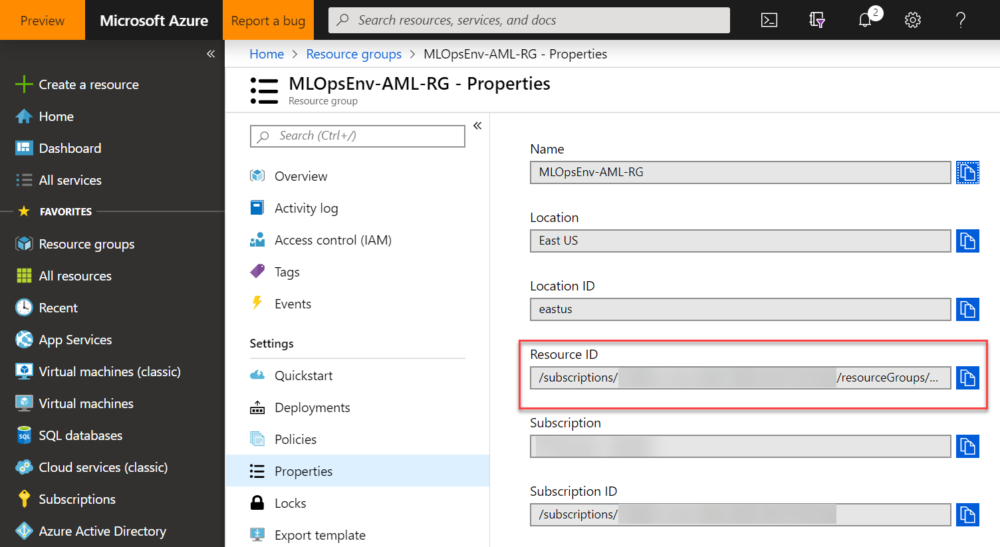
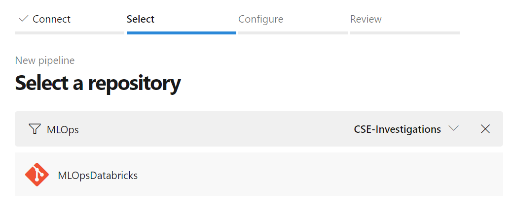
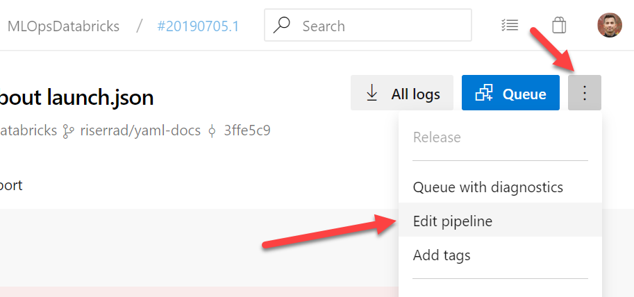
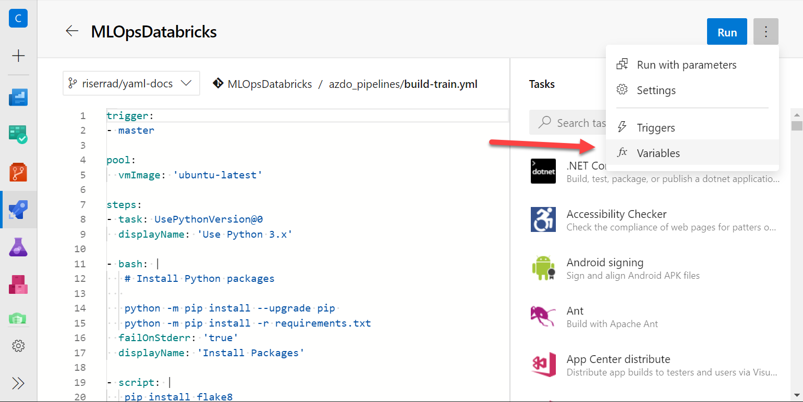
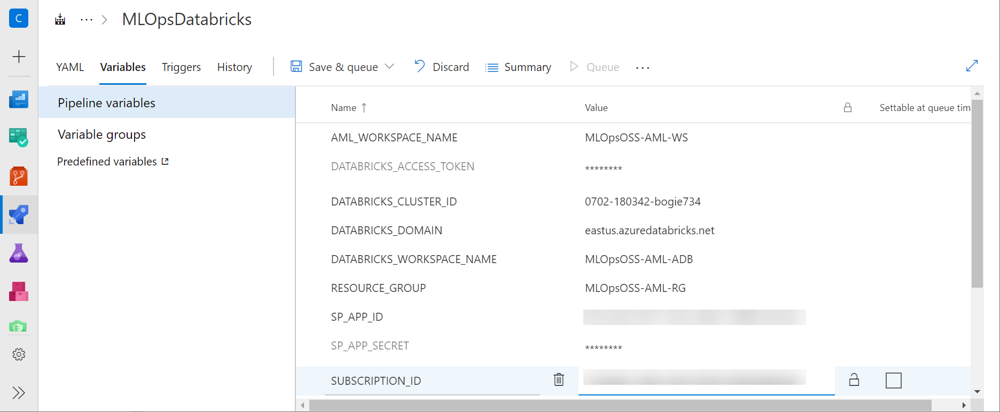
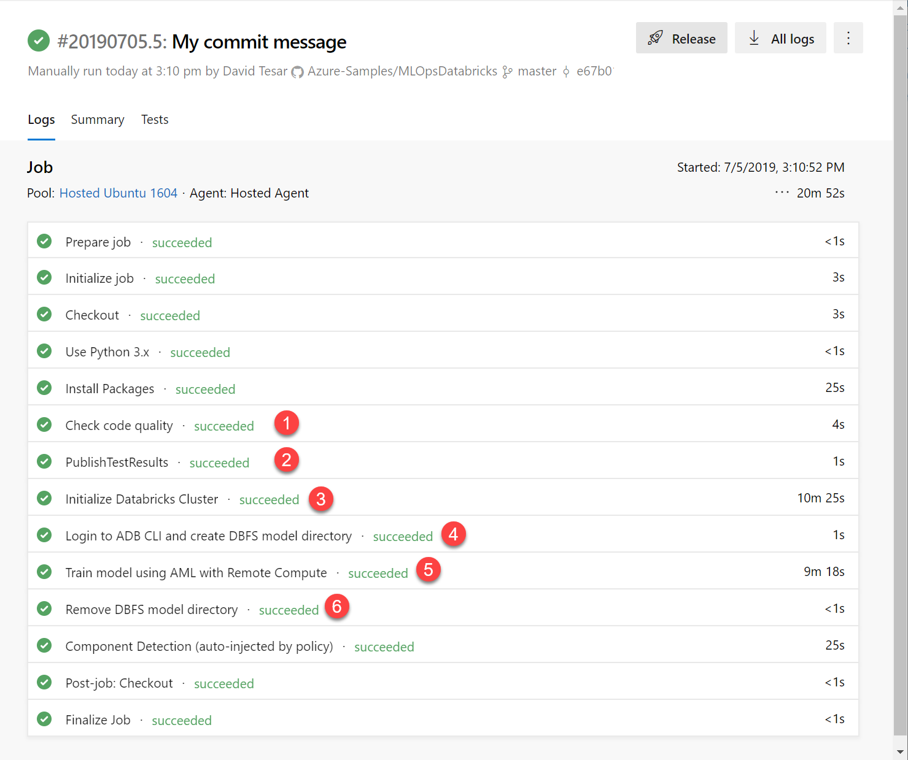
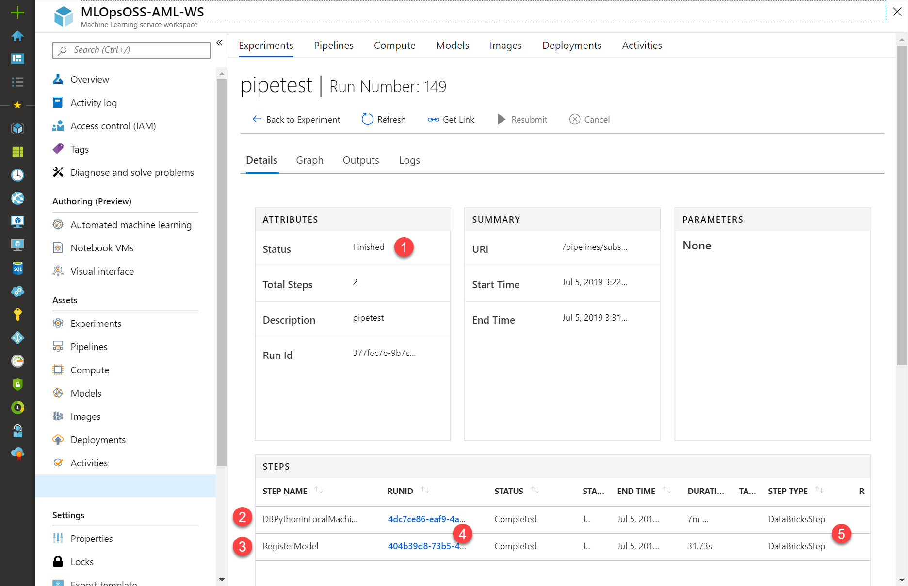

# Setting up the Training Pipeline

This Azure DevOps pipeline will help you operationalize the process to:
- Create or reuse a Databricks cluster to serve as a remote
compute to Azure ML Service
- Attach this cluster as a Compute to Azure ML Service
- Execute the Azure ML pipeline code on this cluster
- Terminate the cluster after the job is done

## Create the Service Principal for the Azure Resource Group

```bash
az ad sp create-for-rbac \
  --name "<name-for-service-principal>" \
  --scopes "<Resource Group ID>"
```

Where:

- `<name-for-service-principal>` is any name with no
spaces and special characters
- `<Resource Group ID>` can be retrieved from the **Properties** tab of the
Resource Group blade that contains all your resources:



## Import this pipeline to your AzDO account

You will use `azdo_pipelines\build-train.yml` to create a new Azure
Pipeline to do all the work to train your model. All the steps are defined
on this file. To use this file to create the Train Pipeline on your account:

- On Azure DevOps, go to `Pipelines > Build`
  - `https://dev.azure.com/<azdo-tenant>/<team-project>/_build` where:
    - `your-azdo-tenant` is your Azure DevOps tenant containing all
    the team projects
    - `team project` is the Team Project you are using to run this sample
- Click `New > New Build Pipeline`
  - `https://dev.azure.com/<azdo-tenant>/<team-project>/_apps/hub/ms.vss-build-web.ci-designer-hub`, where:
    - `<azdo-tenant>` is your Azure DevOps organization
    - `<team-project>` is the Team Project within your AzDO organization
- Choose where is your code
  - For this sample, Azure DevOps Repos was selected
- Choose which repository is your code
  - For this sample, the repo is called *MLOpsDatabricks*



- Select **Existing Azure Pipelines YAML file**
- Select the branch and the file, in this case
`/azdo_pipelines/build-train.yml`, and click **Continue**
- The YAML file will be shown. No changes are required to the file at
this moment.
- Click **Run**

> As of today, a YAML Azure DevOps pipeline needs to have its first run before
> you can set other properties, like *variables* and *triggers*.
> 
> You can either wait for the run to complete (it will fail) or you can cance
> it right after it was triggered. Just use the **Cancel build** button on the
> top right of the build page.

* After the build is stopped/finished, click on the elipisis
and then **Edit pipeline**:



* You will see the build pipeline as below. Click again on the elipisis
and then click on **Variables**



* On **Pipeline variables**, you must add the following
variables and its values:

  * `DATABRICKS_DOMAIN`
  * `DATABRICKS_ACCESS_TOKEN` **(Secret)**
  * About cluster usage:
    * `DATABRICKS_CLUSTER_NAME_SUFFIX`, if you want to create a
    new cluster each pipeline run
    * `DATABRICKS_CLUSTER_ID`, if you want to reuse an
    existing cluster (recommended)
  * `AML_WORKSPACE_NAME`
  * `RESOURCE_GROUP`
  * `SUBSCRIPTION_ID`
  * `TENANT_ID`
  * `SP_APP_ID`
  * `SP_APP_SECRET` **(Secret)**
  * `DATABRICKS_WORKSPACE_NAME`

Make sure to [protect](https://docs.microsoft.com/en-us/azure/devops/pipelines/process/variables?view=azure-devops&tabs=classic%2Cbatch#secret-variables)
either `DATABRICKS_ACCESS_TOKEN` AND `SP_APP_SECRET`.
The pipeline won't work if these variables aren't protected. On the other hand,
do not protect other variables. If you do it, the pipeline won't be able to
read those as environment variables.

  > **Tip**
  > 
  > It's strongly recommended that you add sensitive data to Azure Key Vault
  > and consume the values from the pipeline. Refer to
  > [this documentation](https://docs.microsoft.com/en-us/azure/devops/pipelines/library/variable-groups?view=azure-devops&tabs=yaml#link-secrets-from-an-azure-key-vault)
  > if you want to implement it.
  
  > **Tip**
  > 
  > _Unlike a normal variable, they are not automatically decrypted into
  > environment variables for scripts. You can explicitly map them in, though._
  > 
  > This mapping is already done on the `build-train.yml` file for this sample.
  > Although it's worth mentioning for learning purposes.
  > You can read more [here](https://docs.microsoft.com/en-us/azure/devops/pipelines/process/variables?view=azure-devops&tabs=classic%2Cbatch#secret-variables).

There are other 5 variables that are already set with values at the YAML file:

* `SOURCES_DIR`
* `TRAIN_SCRIPT_PATH`
* `MODEL_DIR`
* `MODEL_NAME`
* `DATABRICKS_COMPUTE_NAME_AML`
  
You have two options to set different values to these variables:

### Override variable values (recommended)

This pipeline is set to override values for these 5 variables if you create
override variables for them. To do so, just create the variable on the designer
with the `_OVERRIDE` suffix. For example

`MODEL_NAME_OVERRIDE` = `my-custom-name`

### Change the YAML file

You're also free to change the YAML file and modify the variable assignment.
The piece of code that is responsible for assigning these variables on the
YAML file is this one:

```yaml
variables:
  SOURCES_DIR: $[coalesce(variables['SOURCES_DIR_OVERRIDE'], '$(Build.SourcesDirectory)')]
  TRAIN_SCRIPT_PATH: $[coalesce(variables['TRAIN_SCRIPT_PATH_OVERRIDE'], 'src/train/train.py')]
  MODEL_DIR: $[coalesce(variables['MODEL_DIR_OVERRIDE'], '/dbfs/model')]
  MODEL_NAME: $[coalesce(variables['MODEL_NAME_OVERRIDE'], 'MLOps-model')]
  DATABRICKS_COMPUTE_NAME_AML: $[coalesce(variables['DATABRICKS_COMPUTE_NAME_AML_OVERRIDE'], 'ADB-Compute')]
```

For more information about `coalesce`, refer to
[this page](https://docs.microsoft.com/en-us/azure/devops/pipelines/process/expressions?view=azure-devops#coalesce).

  * After you have set all the variables, you will end up with something
  similiar to the screen below:

  

  You can now **Save** or **Save & queue** your pipeline.

  ## Running the pipeline and evaluating results

  After you pipeline is ran, you are supposed to see a summary like this:

  

  This is a succeeded pipeline. Below are the details of the important tasks
  this pipeline runs, in case you need to troubleshoot any issue:

  1) **Check code quality**: Runs `flake8` on the code and checks if there
  are any coding style and standard issues, according to PEP8.
  2) **Publish Test Results**: Collects the `flake8` analysis results and
  publishes it as a test result in case you need to see and troubleshoot
  any code analysis problem.
  3) **Initialize Databricks Cluster**: whether you chose for creating a new
  one or using an existing, this task will provision and/or start the cluster
  so the training process can occur.
  4) **Login to ADB CLI and create DBFS model directory**: will take care of
  installing and configuring `databricks-cli` on the agent, and also create
  the `dbfs:/model` directory on the cluster.
  5) **Train model using AML with Remote Compute**: invokes `train_pipeline.py`
  and uses the environment variable values to train the model using the given
  Databricks resources and publishes it to the Azure ML Service.
  6) **Remove DBFS model directory**: makes sure that the cluster is clean
  after all the training work is done.

  If you want to access the experiment job on Azure ML Service, open the logs
  of the task #5 and look for something similar to below:

  ```bash
  To check details of the Pipeline run, go to [experiment-run-URL]
  ```

  If you open this URL, you will end up on the AML Experiment run summary:

  

  Where:

  1) Is the Experiment Run status
  2) Is the Training step
  3) Is the Model Registration step
  4) Is the link to see details of each step run
  5) Is where you can check that both were steps ran on *Databricks*

  ## Read more

  * [Azure DevOps pipelines - Secret variables](https://docs.microsoft.com/en-us/azure/devops/pipelines/process/variables?view=azure-devops&tabs=classic%2Cbatch#secret-variables)
  * [Azure DevOps pipelines - Link secrets from Azure Key Vault](https://docs.microsoft.com/en-us/azure/devops/pipelines/library/variable-groups?view=azure-devops&tabs=yaml#link-secrets-from-an-azure-key-vault)
  * [coalesce expression - Azure Devops Pipelines Expressions](https://docs.microsoft.com/en-us/azure/devops/pipelines/process/expressions?view=azure-devops#coalesce)
