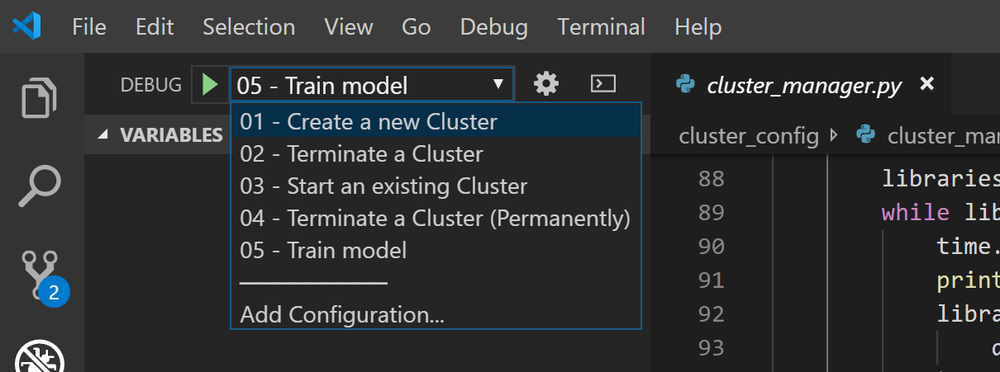

# Visual Studio Code - launch.json sample

If you want to debug either the `cluster_manager.py` or the `train_pipeline.py`
using Visual Studio Code, you can take advantage on this `launch.json` sample
to run it directly from the IDE.

To use it, you need to fill in all the environment variables
according to your cloud infrastructure setup.

Then, you can either add a `launch.json` with this content to your `.vscode`
folder or you can merge an existing file content with the filled sample.

You will end up viewing something similar to this:



> **Tip**
> 
> This is one sample of a `launch.json` that you can use
> on your Visual Studio Code. There are a variety of different approaches
> you can take to create your own `launch.json` to run this code locally.
> 
> Alternatively, consider running the 
> [shell script](bash-environment-variables.md) and then you can remove all
> of the env sections from the launch.json configuration file.
>
> Feel free to submit a Pull Request with different samples of this file,
> so other options are provided to the community to have different experiences.

To understand each environment variable and how to get them, check
the [Project environment variables](project-environment-variables.md) page.

To know more about debugging in Visual Studio Code, visit
[this link](https://code.visualstudio.com/Docs/editor/debugging).

## launch.json file structure

```json
{
    "version": "0.2.0",
    "configurations": [
        {
            "name": "01 - Create a new Cluster",
            "type": "python",
            "request": "launch",
            "program": "${file}",
            "console": "integratedTerminal",
            "env": {
                "DATABRICKS_DOMAIN": "",
                "DATABRICKS_ACCESS_TOKEN": "",
                "DATABRICKS_CLUSTER_NAME_SUFFIX": "mySuffix"
            }
        },
        {
            "name": "02 - Terminate a Cluster",
            "type": "python",
            "request": "launch",
            "program": "${file}",
            "console": "integratedTerminal",
            "env": {
                "DATABRICKS_DOMAIN": "",
                "DATABRICKS_ACCESS_TOKEN": "",
                "DATABRICKS_CLUSTER_ID": ""
            },
            "args": [
                "--terminate"
            ]
        },
        {
            "name": "03 - Start an existing Cluster",
            "type": "python",
            "request": "launch",
            "program": "${file}",
            "console": "integratedTerminal",
            "env": {
                "DATABRICKS_DOMAIN": "",
                "DATABRICKS_ACCESS_TOKEN": "",
                "DATABRICKS_CLUSTER_ID": ""
            }
        },
        {
            "name": "04 - Terminate a Cluster (Permanently)",
            "type": "python",
            "request": "launch",
            "program": "${file}",
            "console": "integratedTerminal",
            "env": {
                "DATABRICKS_DOMAIN": "",
                "DATABRICKS_ACCESS_TOKEN": "",
                "DATABRICKS_CLUSTER_ID": ""
            },
            "args": [
                "--terminate",
                "--permanent"
            ]
        },
        {
            "name": "05 - Train model",
            "type": "python",
            "request": "launch",
            "program": "${file}",
            "console": "integratedTerminal",
            "env": {
                "DATABRICKS_DOMAIN": "",
                "DATABRICKS_ACCESS_TOKEN": "",
                "DATABRICKS_CLUSTER_ID": "",
                "AML_WORKSPACE_NAME": "MLOpsOSS-AML-WS",
                "RESOURCE_GROUP": "MLOpsOSS-AML-RG",
                "SUBSCRIPTION_ID": "",
                "TENANT_ID": "",
                "SP_APP_ID": "",
                "SP_APP_SECRET": "",
                "SOURCES_DIR": "",
                "TRAIN_SCRIPT_PATH": "src/train/train.py",
                "DATABRICKS_WORKSPACE_NAME": "MLOpsOSS-AML-ADB",
                "DATABRICKS_COMPUTE_NAME_AML": "ADB-Compute",
                "MODEL_DIR": "/dbfs/model",
                "MODEL_NAME": "mymodel"
            }
        }
    ]
}
```

## Read more

* [Project environment variables](project-environment-variables.md)
* [Debugging in Visual Studio Code](https://code.visualstudio.com/Docs/editor/debugging)